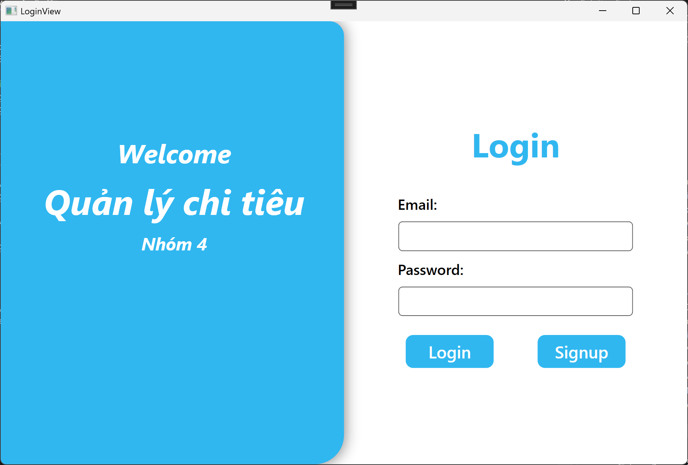
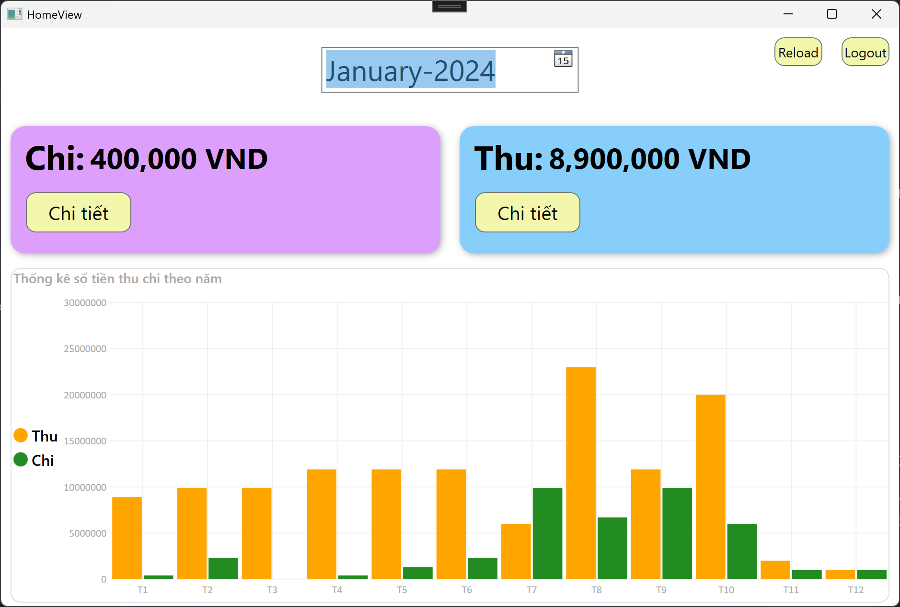
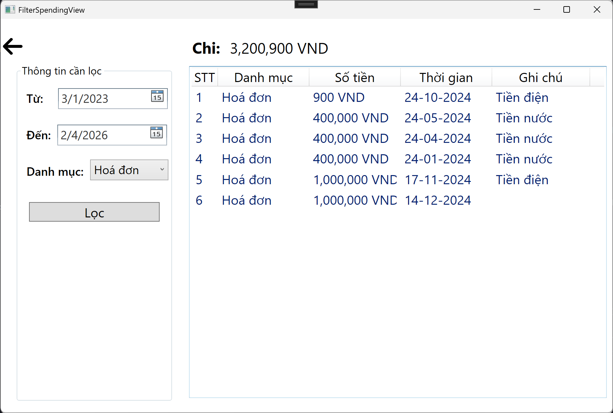
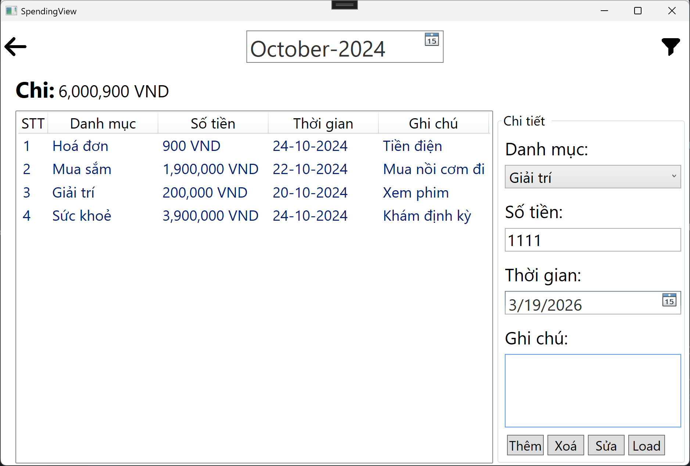

# QuanLyChiTieu

Ung dung quan ly chi tieu ca nhan xay dung bang WPF (.NET Framework 4.7.2), su dung Entity Framework 6 va SQL Server.

## 1. Cong nghe su dung

- .NET Framework 4.7.2
- WPF (MVVM)
- Entity Framework 6.2.0 (Database First)
- SQL Server
- LiveCharts (hien thi bieu do thu/chi)

## 2. Yeu cau moi truong

Can cai dat cac thanh phan sau truoc khi chay:

- Windows 10/11
- Visual Studio 2022 (khuyen nghi ban Community tro len)
- Workload: .NET desktop development
- SQL Server (Express/Developer/Standard deu duoc)
- SQL Server Management Studio (SSMS) de import database

## 3. Cai dat va chay du an

### Buoc 1: Clone hoac tai source code

Dat source code vao thu muc lam viec, vi du:

```powershell
git clone <repo-url>
cd QuanLyChiTieu
```

### Buoc 2: Tao database

1. Mo SSMS va ket noi toi SQL Server instance cua ban.
2. Mo file script:

```text
QuanLyChiTieu/Database/quanlychitieunhom04.sql
```

3. Execute toan bo script de tao database `QuanLyChiTieu`, bang du lieu, stored procedure va du lieu mau.

### Buoc 3: Kiem tra chuoi ket noi

Du an su dung file cau hinh:

```text
QuanLyChiTieu/App.config
```

Mac dinh:

```xml
data source=.;initial catalog=QuanLyChiTieu;integrated security=True
```

Neu SQL Server cua ban khac, sua `data source`:

- SQL Express: `data source=.\\SQLEXPRESS`
- LocalDB: `data source=(localdb)\\MSSQLLocalDB`
- Server cu the: `data source=TEN_MAY_CHU`

### Buoc 4: Mo solution va build

1. Mo file:

```text
QuanLyChiTieu.sln
```

2. Chon cau hinh:

- Configuration: `Debug`
- Platform: `Any CPU`

3. Build va chay:

- Nhan `F5` (Start Debugging), hoac
- `Ctrl + F5` (Run without debugging)

### Buoc 5: Dang nhap tai khoan mau

Sau khi chay ung dung, dung tai khoan co san trong script du lieu:

- Email: `admin@gmail.com`
- Password: `admin`

## 4. Chay bang command line (tuy chon)

Luu y: day la du an .NET Framework co (WPF + EF Database First), khuyen nghi build bang MSBuild cua Visual Studio thay vi `dotnet build`.

```powershell
"C:\Program Files\Microsoft Visual Studio\2022\Community\MSBuild\Current\Bin\MSBuild.exe" QuanLyChiTieu.sln /t:Build /p:Configuration=Debug /p:Platform="Any CPU"
```

File chay sau khi build:

```text
QuanLyChiTieu/bin/Debug/QuanLyChiTieu.exe
```

## 5. Anh demo

### Man hinh dang nhap



### Man hinh trang chu



### Man hinh loc du lieu



### Man hinh chi tiet



## 6. Loi thuong gap va cach xu ly

### Loi khong ket noi duoc database

- Kiem tra ten SQL Server instance trong `App.config`
- Kiem tra da chay script tao DB chua
- Kiem tra account dang dung co quyen truy cap DB

### Loi build do thieu package

- Du an dang tham chieu package tu thu muc `packages/`
- Neu mo dung source va cau truc thu muc, package se duoc nhan dien
- Co the Clean Solution va Rebuild lai

### Loi startup man hinh

- Ung dung startup tai `View/HomeView.xaml`
- Home se goi `LoginView` truoc khi vao man hinh chinh
- Neu dong Login ma khong dang nhap, ung dung se thoat

## 7. Cau truc thu muc chinh

- `QuanLyChiTieu/Model`: Entity va DbContext (EF Database First)
- `QuanLyChiTieu/View`: XAML view
- `QuanLyChiTieu/ViewModel`: logic MVVM
- `QuanLyChiTieu/Database`: script SQL tao CSDL
- `ImgDemo`: anh demo giao dien